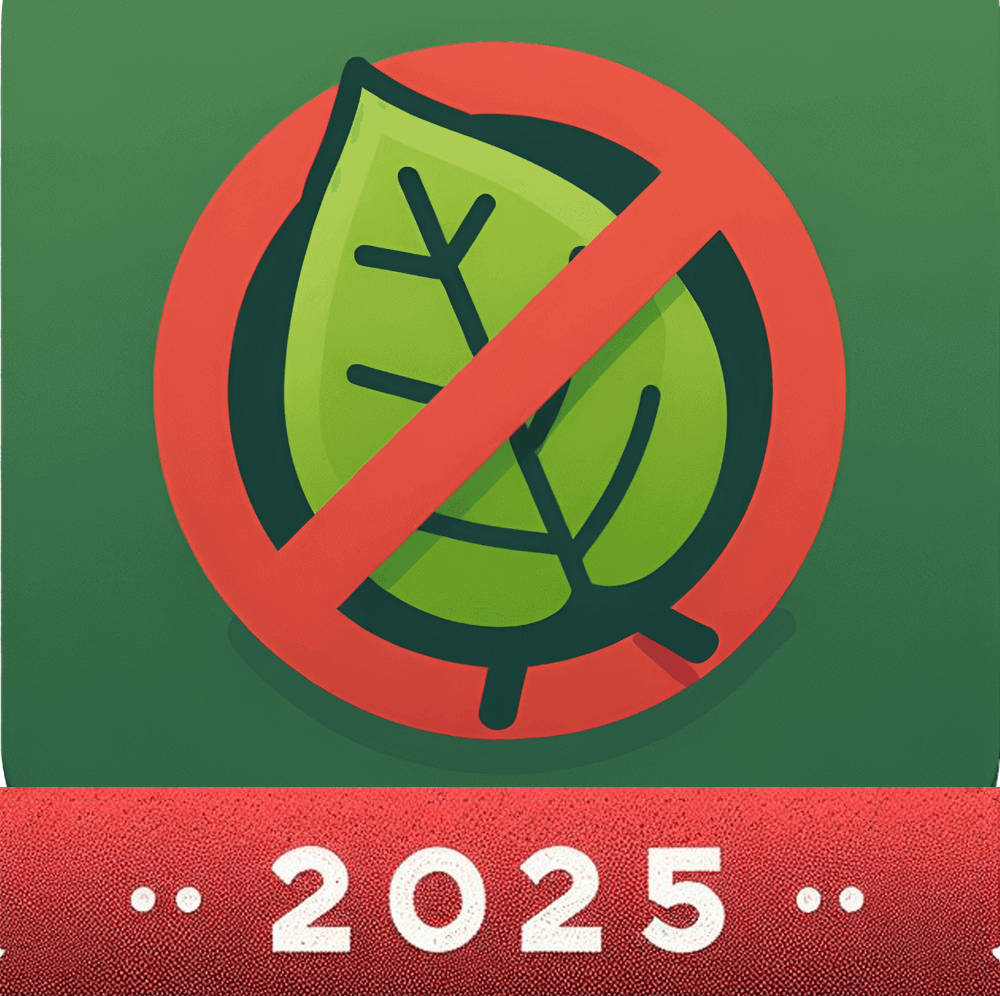

# MongoBan

MongoBan is still in beta, so please keep an eye on our changelog to prepare to modify the configuration files.

I will make a database upgrade script every time the database structure is updated, and it will be automatically run when the server is started.

## Install

MongoBan needs the following dependencies:

- MongoDB 8
- Redis (Optional)
- A Minecraft server (Incompatible with Mod Loader)
- Java 21

The following is a compatible version of the server:

- Paper, Purpur, Folia: 1.18.2+ (WIP)
- Velocity: 3.4.0+ (WIP)
- BungeeCord: 1.18.2+ (WIP)

## MongoBan API
Mongoban API is not completed, please do not use in the production environment.

## Usage Agreement

MongoBan is a plugin designed to provide advanced banning capabilities for Minecraft server software,
including Paper, BungeeCord, and Velocity.

It utilizes MongoDB solely as a storage database and has no affiliation with MongoDB or MongoDB,
Inc. MongoDB® is a registered trademark of MongoDB, Inc.

### License and Usage

MongoBan is open-source software distributed under the Apache 2.0 License.
It is free to use under all circumstances, and no paid support is provided.

By using MongoBan, you agree to comply with the Apache 2.0 License as well as the following additional terms:

**Attribution:** When redistributing MongoBan, you must give appropriate credit to the original creators.
Misrepresenting yourself as the original creator is prohibited.

**Monetization:** If you wish to monetize MongoBan, you must:

- Fork the project and create a derivative work with unique features and functionalities.

- Avoid selling unmodified or minimally modified versions of MongoBan.

- Refrain from profiting off server bundles preloaded with MongoBan.

- Comply fully with the Apache 2.0 License in any derivative or commercial use.

### Disclaimer

MongoBan is intended solely for lawful purposes, assisting users in managing database-related content.

The developers are not responsible for any misuse of the software, including but not limited to illegal activities,
unauthorized data operations, or any consequences arising from such actions.

Users assume full responsibility for any risks or damages incurred through the use of MongoBan.

By downloading, using, or redistributing MongoBan, you acknowledge that you have read, understood,
and agreed to the terms outlined in this disclaimer.

### Support and Contributions

If you would like to support the MongoBan project, consider the following:

- Reporting issues on our GitHub repository.

- Downloading MongoBan via Modrinth.

- Subscribing to our Patreon (subscriptions provide no additional benefits).

For further questions or clarifications, please contact the developers through the official support channels.

## License

The following is a list of third-party libraries and dependencies used in the MongoBan project along with their
respective licenses. 

Every attempt has been made to comply with the terms of these licenses. 

Please review the license terms of each individual dependency for detailed information on their usage and distribution rights.

### A
- Adventure [MIT] [[Github](https://github.com/KyoriPowered/adventure)]
- Annotations [Apache-2.0] [[Github](https://github.com/JetBrains/java-annotations)]
### C
- Caffeine [Apache-2.0] [[Github](https://github.com/ben-manes/caffeine)]
### E
- EO YAML [Apache-2.0] [[Github](https://github.com/decorators-squad/eo-yaml)]
### F
- FastJson2 [Apache-2.0] [[Github](https://github.com/alibaba/fastjson2)]
### G
- Gson [Apache-2.0] [[Github](https://github.com/google/gson)]
- Guava [Apache-2.0] [[Github](https://github.com/google/guava)]
### I
- IRScheduler [Apache-2.0] [[Github](https://github.com/404Setup/irs)]
### J
- Jedis [MIT] [[Github](https://github.com/redis/jedis)]
### M
- Mongo Java Driver [Apache-2.0] [[Github](https://github.com/mongodb/mongo-java-driver)]
### R
- RecordArgs [Apache-2.0] [[Github](https://github.com/nipafx/record-args)]